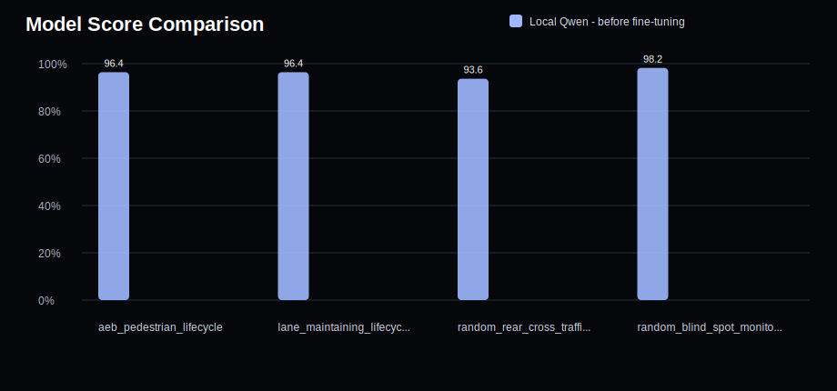
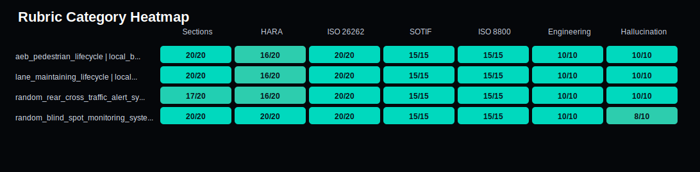

# Model Evaluation Report

Generated: 2026-05-27T19:00:09

## Plots

### Score Comparison

### Rubric Heatmap

| Question ID | Model | Score | Raw | Hallucination | HARA | ISO 26262 | SOTIF | ISO 8800 |
|---|---|---:|---:|---:|---:|---:|---:|---:|
| aeb_pedestrian_lifecycle | Local Qwen - before fine-tuning | 96.4% | 106/110 | 10 | 16 | 20 | 15 | 15 |
| lane_maintaining_lifecycle | Local Qwen - before fine-tuning | 96.4% | 106/110 | 10 | 16 | 20 | 15 | 15 |
| random_rear_cross_traffic_alert_system_1 | Local Qwen - before fine-tuning | 93.6% | 103/110 | 10 | 16 | 20 | 15 | 15 |
| random_blind_spot_monitoring_system_2 | Local Qwen - before fine-tuning | 98.2% | 108/110 | 8 | 20 | 20 | 15 | 15 |

## aeb_pedestrian_lifecycle - Local Qwen - before fine-tuning

- Score: 96.4%
- Raw score: 106/110
- Missing items: ['S/E/C ratings']
- Hallucination flags: None

## lane_maintaining_lifecycle - Local Qwen - before fine-tuning

- Score: 96.4%
- Raw score: 106/110
- Missing items: ['S/E/C ratings']
- Hallucination flags: None

## random_rear_cross_traffic_alert_system_1 - Local Qwen - before fine-tuning

- Score: 93.6%
- Raw score: 103/110
- Missing items: ['Worst-Case Scenario', 'Final Safety Argument', 'S/E/C ratings']
- Hallucination flags: None

## random_blind_spot_monitoring_system_2 - Local Qwen - before fine-tuning

- Score: 98.2%
- Raw score: 108/110
- Missing items: None
- Hallucination flags: ['unsupported exact clause 7.5.1']
