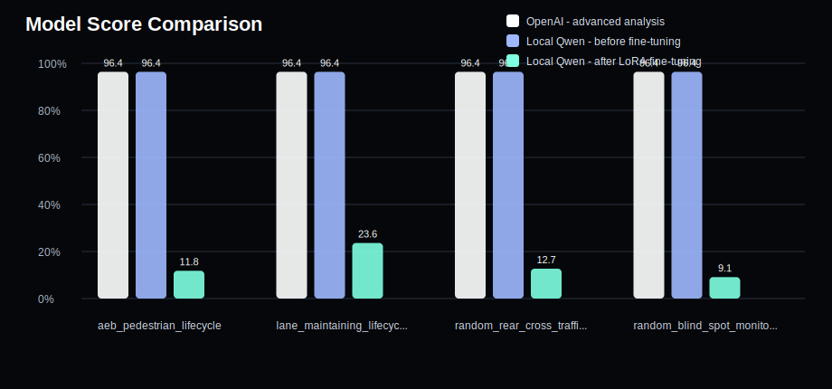
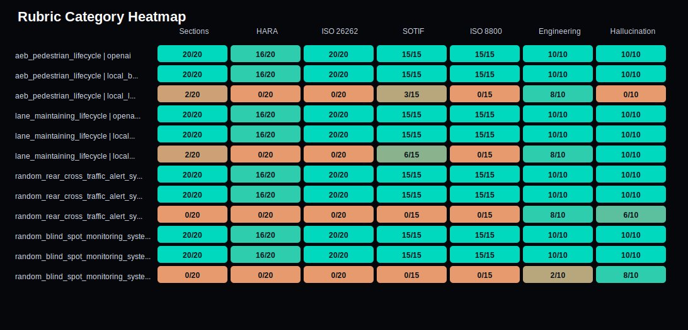

# Model Evaluation Report

Generated: 2026-05-27T21:56:36

## Plots

### Score Comparison

### Rubric Heatmap

| Question ID | Model | Score | Raw | Hallucination | HARA | ISO 26262 | SOTIF | ISO 8800 |
|---|---|---:|---:|---:|---:|---:|---:|---:|
| aeb_pedestrian_lifecycle | OpenAI - advanced analysis | 96.4% | 106/110 | 10 | 16 | 20 | 15 | 15 |
| aeb_pedestrian_lifecycle | Local Qwen - before fine-tuning | 96.4% | 106/110 | 10 | 16 | 20 | 15 | 15 |
| aeb_pedestrian_lifecycle | Local Qwen - after LoRA fine-tuning | 11.8% | 13/110 | 0 | 0 | 0 | 3 | 0 |
| lane_maintaining_lifecycle | OpenAI - advanced analysis | 96.4% | 106/110 | 10 | 16 | 20 | 15 | 15 |
| lane_maintaining_lifecycle | Local Qwen - before fine-tuning | 96.4% | 106/110 | 10 | 16 | 20 | 15 | 15 |
| lane_maintaining_lifecycle | Local Qwen - after LoRA fine-tuning | 23.6% | 26/110 | 10 | 0 | 0 | 6 | 0 |
| random_rear_cross_traffic_alert_system_1 | OpenAI - advanced analysis | 96.4% | 106/110 | 10 | 16 | 20 | 15 | 15 |
| random_rear_cross_traffic_alert_system_1 | Local Qwen - before fine-tuning | 96.4% | 106/110 | 10 | 16 | 20 | 15 | 15 |
| random_rear_cross_traffic_alert_system_1 | Local Qwen - after LoRA fine-tuning | 12.7% | 14/110 | 6 | 0 | 0 | 0 | 0 |
| random_blind_spot_monitoring_system_2 | OpenAI - advanced analysis | 96.4% | 106/110 | 10 | 16 | 20 | 15 | 15 |
| random_blind_spot_monitoring_system_2 | Local Qwen - before fine-tuning | 96.4% | 106/110 | 10 | 16 | 20 | 15 | 15 |
| random_blind_spot_monitoring_system_2 | Local Qwen - after LoRA fine-tuning | 9.1% | 10/110 | 8 | 0 | 0 | 0 | 0 |

## aeb_pedestrian_lifecycle - OpenAI - advanced analysis

- Score: 96.4%
- Raw score: 106/110
- Missing items: ['S/E/C ratings']
- Hallucination flags: None

## aeb_pedestrian_lifecycle - Local Qwen - before fine-tuning

- Score: 96.4%
- Raw score: 106/110
- Missing items: ['S/E/C ratings']
- Hallucination flags: None

## aeb_pedestrian_lifecycle - Local Qwen - after LoRA fine-tuning

- Score: 11.8%
- Raw score: 13/110
- Missing items: ['Opening Map', 'Item Definition', 'Functional Decomposition', 'HARA Screening', 'Safety Goals, Functional Safety Concept, and Technical Safety Concept', 'ISO 26262 Part 2-9 Lifecycle Assessment', 'ISO 21448 (SOTIF) Function Analysis', 'ISO 8800 Function Assurance', 'Production and Operation Controls', 'Worst-Case Scenario', 'Final Safety Argument', 'HARA section', 'HARA markdown table with ASIL/QM', 'S/E/C ratings', 'S/E/C rationale', 'ASIL/QM outcome', 'Part 2', 'Part 3', 'Part 4', 'Part 5', 'Part 6', 'Part 7', 'Part 8', 'Part 9', 'system/hardware/software specificity', 'triggering conditions', 'ODD boundary/assumption', 'performance limitation', 'residual risk/mitigation', 'ISO 8800 mention', 'data requirement or dataset gap', 'robustness/uncertainty', 'OOD/distribution shift', 'release gate/monitoring/change control', 'safe-state/degraded-mode detail']
- Hallucination flags: ['unsupported exact clause 10.10', 'unsupported exact clause 10.11', 'unsupported exact clause 10.12', 'unsupported exact clause 10.13', 'unsupported exact clause 10.14', 'unsupported exact clause 10.15', 'unsupported exact clause 10.16', 'unsupported exact clause 10.17', 'unsupported exact clause 10.18', 'unsupported exact clause 10.19', 'unsupported exact clause 10.2', 'unsupported exact clause 10.20', 'unsupported exact clause 10.21', 'unsupported exact clause 10.3', 'unsupported exact clause 10.4', 'unsupported exact clause 10.6', 'unsupported exact clause 10.7', 'unsupported exact clause 10.8', 'unsupported exact clause 10.9', 'unsupported ISO clause-like claim: iso 21448 | full standard | clause 10.10', 'unsupported ISO clause-like claim: iso 21448 | full standard | clause 10.11', 'unsupported ISO clause-like claim: iso 21448 | full standard | clause 10.12', 'unsupported ISO clause-like claim: iso 21448 | full standard | clause 10.13', 'unsupported ISO clause-like claim: iso 21448 | full standard | clause 10.14', 'unsupported ISO clause-like claim: iso 21448 | full standard | clause 10.15', 'unsupported ISO clause-like claim: iso 21448 | full standard | clause 10.16', 'unsupported ISO clause-like claim: iso 21448 | full standard | clause 10.17', 'unsupported ISO clause-like claim: iso 21448 | full standard | clause 10.18', 'unsupported ISO clause-like claim: iso 21448 | full standard | clause 10.19', 'unsupported ISO clause-like claim: iso 21448 | full standard | clause 10.2', 'unsupported ISO clause-like claim: iso 21448 | full standard | clause 10.20', 'unsupported ISO clause-like claim: iso 21448 | full standard | clause 10.21', 'unsupported ISO clause-like claim: iso 21448 | full standard | clause 10.3', 'unsupported ISO clause-like claim: iso 21448 | full standard | clause 10.4', 'unsupported ISO clause-like claim: iso 21448 | full standard | clause 10.6', 'unsupported ISO clause-like claim: iso 21448 | full standard | clause 10.7', 'unsupported ISO clause-like claim: iso 21448 | full standard | clause 10.8', 'unsupported ISO clause-like claim: iso 21448 | full standard | clause 10.9']

## lane_maintaining_lifecycle - OpenAI - advanced analysis

- Score: 96.4%
- Raw score: 106/110
- Missing items: ['S/E/C ratings']
- Hallucination flags: None

## lane_maintaining_lifecycle - Local Qwen - before fine-tuning

- Score: 96.4%
- Raw score: 106/110
- Missing items: ['S/E/C ratings']
- Hallucination flags: None

## lane_maintaining_lifecycle - Local Qwen - after LoRA fine-tuning

- Score: 23.6%
- Raw score: 26/110
- Missing items: ['Opening Map', 'Item Definition', 'Functional Decomposition', 'HARA Screening', 'ISO 26262 Part 2-9 Lifecycle Assessment', 'ISO 8800 Function Assurance', 'Verification and Validation Matrix', 'Production and Operation Controls', 'Worst-Case Scenario', 'Final Safety Argument', 'HARA section', 'HARA markdown table with ASIL/QM', 'S/E/C ratings', 'S/E/C rationale', 'ASIL/QM outcome', 'Part 2', 'Part 3', 'Part 4', 'Part 5', 'Part 6', 'Part 7', 'Part 8', 'Part 9', 'system/hardware/software specificity', 'ODD boundary/assumption', 'performance limitation', 'residual risk/mitigation', 'ISO 8800 mention', 'data requirement or dataset gap', 'robustness/uncertainty', 'OOD/distribution shift', 'release gate/monitoring/change control', 'safe-state/degraded-mode detail']
- Hallucination flags: None

## random_rear_cross_traffic_alert_system_1 - OpenAI - advanced analysis

- Score: 96.4%
- Raw score: 106/110
- Missing items: ['S/E/C ratings']
- Hallucination flags: None

## random_rear_cross_traffic_alert_system_1 - Local Qwen - before fine-tuning

- Score: 96.4%
- Raw score: 106/110
- Missing items: ['S/E/C ratings']
- Hallucination flags: None

## random_rear_cross_traffic_alert_system_1 - Local Qwen - after LoRA fine-tuning

- Score: 12.7%
- Raw score: 14/110
- Missing items: ['Opening Map', 'Item Definition', 'Functional Decomposition', 'HARA Screening', 'Safety Goals, Functional Safety Concept, and Technical Safety Concept', 'ISO 26262 Part 2-9 Lifecycle Assessment', 'ISO 21448 (SOTIF) Function Analysis', 'ISO 8800 Function Assurance', 'Verification and Validation Matrix', 'Production and Operation Controls', 'Worst-Case Scenario', 'Final Safety Argument', 'HARA section', 'HARA markdown table with ASIL/QM', 'S/E/C ratings', 'S/E/C rationale', 'ASIL/QM outcome', 'Part 2', 'Part 3', 'Part 4', 'Part 5', 'Part 6', 'Part 7', 'Part 8', 'Part 9', 'system/hardware/software specificity', 'ISO 21448/SOTIF mention', 'triggering conditions', 'ODD boundary/assumption', 'performance limitation', 'residual risk/mitigation', 'ISO 8800 mention', 'data requirement or dataset gap', 'robustness/uncertainty', 'OOD/distribution shift', 'release gate/monitoring/change control', 'safe-state/degraded-mode detail']
- Hallucination flags: ['unsupported exact clause 12.2.4.3', 'unsupported ISO clause-like claim: iso 26262 | part 10 | clause 12.2.4.3']

## random_blind_spot_monitoring_system_2 - OpenAI - advanced analysis

- Score: 96.4%
- Raw score: 106/110
- Missing items: ['S/E/C ratings']
- Hallucination flags: None

## random_blind_spot_monitoring_system_2 - Local Qwen - before fine-tuning

- Score: 96.4%
- Raw score: 106/110
- Missing items: ['S/E/C ratings']
- Hallucination flags: None

## random_blind_spot_monitoring_system_2 - Local Qwen - after LoRA fine-tuning

- Score: 9.1%
- Raw score: 10/110
- Missing items: ['Opening Map', 'Item Definition', 'Functional Decomposition', 'HARA Screening', 'Safety Goals, Functional Safety Concept, and Technical Safety Concept', 'ISO 26262 Part 2-9 Lifecycle Assessment', 'ISO 21448 (SOTIF) Function Analysis', 'ISO 8800 Function Assurance', 'Verification and Validation Matrix', 'Production and Operation Controls', 'Worst-Case Scenario', 'Final Safety Argument', 'HARA section', 'HARA markdown table with ASIL/QM', 'S/E/C ratings', 'S/E/C rationale', 'ASIL/QM outcome', 'Part 2', 'Part 3', 'Part 4', 'Part 5', 'Part 6', 'Part 7', 'Part 8', 'Part 9', 'system/hardware/software specificity', 'ISO 21448/SOTIF mention', 'triggering conditions', 'ODD boundary/assumption', 'performance limitation', 'residual risk/mitigation', 'ISO 8800 mention', 'data requirement or dataset gap', 'robustness/uncertainty', 'OOD/distribution shift', 'release gate/monitoring/change control', 'answer may be too short', 'measurable evidence/test/diagnostic detail', 'safe-state/degraded-mode detail']
- Hallucination flags: ['no evidence/assumption limitation stated']
