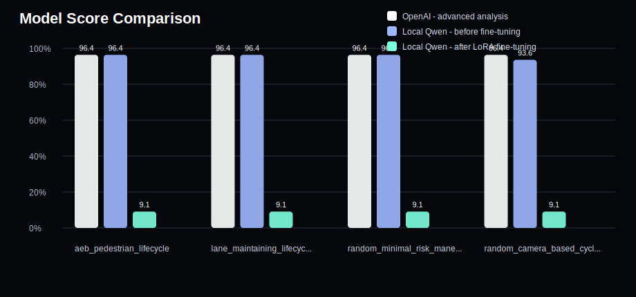
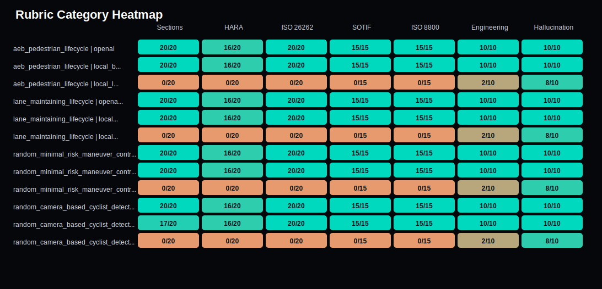

# Model Evaluation Report

Generated: 2026-05-28T09:30:55

## Plots

### Score Comparison

### Rubric Heatmap

| Question ID | Model | Score | Raw | Hallucination | HARA | ISO 26262 | SOTIF | ISO 8800 |
|---|---|---:|---:|---:|---:|---:|---:|---:|
| aeb_pedestrian_lifecycle | OpenAI - advanced analysis | 96.4% | 106/110 | 10 | 16 | 20 | 15 | 15 |
| aeb_pedestrian_lifecycle | Local Qwen - before fine-tuning | 96.4% | 106/110 | 10 | 16 | 20 | 15 | 15 |
| aeb_pedestrian_lifecycle | Local Qwen - after LoRA fine-tuning | 9.1% | 10/110 | 8 | 0 | 0 | 0 | 0 |
| lane_maintaining_lifecycle | OpenAI - advanced analysis | 96.4% | 106/110 | 10 | 16 | 20 | 15 | 15 |
| lane_maintaining_lifecycle | Local Qwen - before fine-tuning | 96.4% | 106/110 | 10 | 16 | 20 | 15 | 15 |
| lane_maintaining_lifecycle | Local Qwen - after LoRA fine-tuning | 9.1% | 10/110 | 8 | 0 | 0 | 0 | 0 |
| random_minimal_risk_maneuver_controller_1 | OpenAI - advanced analysis | 96.4% | 106/110 | 10 | 16 | 20 | 15 | 15 |
| random_minimal_risk_maneuver_controller_1 | Local Qwen - before fine-tuning | 96.4% | 106/110 | 10 | 16 | 20 | 15 | 15 |
| random_minimal_risk_maneuver_controller_1 | Local Qwen - after LoRA fine-tuning | 9.1% | 10/110 | 8 | 0 | 0 | 0 | 0 |
| random_camera_based_cyclist_detection_system_2 | OpenAI - advanced analysis | 96.4% | 106/110 | 10 | 16 | 20 | 15 | 15 |
| random_camera_based_cyclist_detection_system_2 | Local Qwen - before fine-tuning | 93.6% | 103/110 | 10 | 16 | 20 | 15 | 15 |
| random_camera_based_cyclist_detection_system_2 | Local Qwen - after LoRA fine-tuning | 9.1% | 10/110 | 8 | 0 | 0 | 0 | 0 |

## aeb_pedestrian_lifecycle - OpenAI - advanced analysis

- Score: 96.4%
- Raw score: 106/110
- Missing items: ['S/E/C ratings']
- Hallucination flags: None

## aeb_pedestrian_lifecycle - Local Qwen - before fine-tuning

- Score: 96.4%
- Raw score: 106/110
- Missing items: ['S/E/C ratings']
- Hallucination flags: None

## aeb_pedestrian_lifecycle - Local Qwen - after LoRA fine-tuning

- Score: 9.1%
- Raw score: 10/110
- Missing items: ['Opening Map', 'Item Definition', 'Functional Decomposition', 'HARA Screening', 'Safety Goals, Functional Safety Concept, and Technical Safety Concept', 'ISO 26262 Part 2-9 Lifecycle Assessment', 'ISO 21448 (SOTIF) Function Analysis', 'ISO 8800 Function Assurance', 'Verification and Validation Matrix', 'Production and Operation Controls', 'Worst-Case Scenario', 'Final Safety Argument', 'HARA section', 'HARA markdown table with ASIL/QM', 'S/E/C ratings', 'S/E/C rationale', 'ASIL/QM outcome', 'Part 2', 'Part 3', 'Part 4', 'Part 5', 'Part 6', 'Part 7', 'Part 8', 'Part 9', 'system/hardware/software specificity', 'ISO 21448/SOTIF mention', 'triggering conditions', 'ODD boundary/assumption', 'performance limitation', 'residual risk/mitigation', 'ISO 8800 mention', 'data requirement or dataset gap', 'robustness/uncertainty', 'OOD/distribution shift', 'release gate/monitoring/change control', 'answer may be too short', 'measurable evidence/test/diagnostic detail', 'safe-state/degraded-mode detail']
- Hallucination flags: ['no evidence/assumption limitation stated']

## lane_maintaining_lifecycle - OpenAI - advanced analysis

- Score: 96.4%
- Raw score: 106/110
- Missing items: ['S/E/C ratings']
- Hallucination flags: None

## lane_maintaining_lifecycle - Local Qwen - before fine-tuning

- Score: 96.4%
- Raw score: 106/110
- Missing items: ['S/E/C ratings']
- Hallucination flags: None

## lane_maintaining_lifecycle - Local Qwen - after LoRA fine-tuning

- Score: 9.1%
- Raw score: 10/110
- Missing items: ['Opening Map', 'Item Definition', 'Functional Decomposition', 'HARA Screening', 'ISO 26262 Part 2-9 Lifecycle Assessment', 'ISO 21448 (SOTIF) Function Analysis', 'ISO 8800 Function Assurance', 'Verification and Validation Matrix', 'Production and Operation Controls', 'Worst-Case Scenario', 'Final Safety Argument', 'HARA section', 'HARA markdown table with ASIL/QM', 'S/E/C ratings', 'S/E/C rationale', 'ASIL/QM outcome', 'Part 2', 'Part 3', 'Part 4', 'Part 5', 'Part 6', 'Part 7', 'Part 8', 'Part 9', 'system/hardware/software specificity', 'ISO 21448/SOTIF mention', 'triggering conditions', 'ODD boundary/assumption', 'performance limitation', 'residual risk/mitigation', 'ISO 8800 mention', 'data requirement or dataset gap', 'robustness/uncertainty', 'OOD/distribution shift', 'release gate/monitoring/change control', 'answer may be too short', 'measurable evidence/test/diagnostic detail', 'safe-state/degraded-mode detail']
- Hallucination flags: ['no evidence/assumption limitation stated']

## random_minimal_risk_maneuver_controller_1 - OpenAI - advanced analysis

- Score: 96.4%
- Raw score: 106/110
- Missing items: ['S/E/C ratings']
- Hallucination flags: None

## random_minimal_risk_maneuver_controller_1 - Local Qwen - before fine-tuning

- Score: 96.4%
- Raw score: 106/110
- Missing items: ['S/E/C ratings']
- Hallucination flags: None

## random_minimal_risk_maneuver_controller_1 - Local Qwen - after LoRA fine-tuning

- Score: 9.1%
- Raw score: 10/110
- Missing items: ['Opening Map', 'Item Definition', 'Functional Decomposition', 'HARA Screening', 'Safety Goals, Functional Safety Concept, and Technical Safety Concept', 'ISO 26262 Part 2-9 Lifecycle Assessment', 'ISO 21448 (SOTIF) Function Analysis', 'ISO 8800 Function Assurance', 'Verification and Validation Matrix', 'Production and Operation Controls', 'Worst-Case Scenario', 'Final Safety Argument', 'HARA section', 'HARA markdown table with ASIL/QM', 'S/E/C ratings', 'S/E/C rationale', 'ASIL/QM outcome', 'Part 2', 'Part 3', 'Part 4', 'Part 5', 'Part 6', 'Part 7', 'Part 8', 'Part 9', 'system/hardware/software specificity', 'ISO 21448/SOTIF mention', 'triggering conditions', 'ODD boundary/assumption', 'performance limitation', 'residual risk/mitigation', 'ISO 8800 mention', 'data requirement or dataset gap', 'robustness/uncertainty', 'OOD/distribution shift', 'release gate/monitoring/change control', 'answer may be too short', 'measurable evidence/test/diagnostic detail', 'safe-state/degraded-mode detail']
- Hallucination flags: ['no evidence/assumption limitation stated']

## random_camera_based_cyclist_detection_system_2 - OpenAI - advanced analysis

- Score: 96.4%
- Raw score: 106/110
- Missing items: ['S/E/C ratings']
- Hallucination flags: None

## random_camera_based_cyclist_detection_system_2 - Local Qwen - before fine-tuning

- Score: 93.6%
- Raw score: 103/110
- Missing items: ['Worst-Case Scenario', 'Final Safety Argument', 'S/E/C ratings']
- Hallucination flags: None

## random_camera_based_cyclist_detection_system_2 - Local Qwen - after LoRA fine-tuning

- Score: 9.1%
- Raw score: 10/110
- Missing items: ['Opening Map', 'Item Definition', 'Functional Decomposition', 'HARA Screening', 'Safety Goals, Functional Safety Concept, and Technical Safety Concept', 'ISO 26262 Part 2-9 Lifecycle Assessment', 'ISO 21448 (SOTIF) Function Analysis', 'ISO 8800 Function Assurance', 'Verification and Validation Matrix', 'Production and Operation Controls', 'Worst-Case Scenario', 'Final Safety Argument', 'HARA section', 'HARA markdown table with ASIL/QM', 'S/E/C ratings', 'S/E/C rationale', 'ASIL/QM outcome', 'Part 2', 'Part 3', 'Part 4', 'Part 5', 'Part 6', 'Part 7', 'Part 8', 'Part 9', 'system/hardware/software specificity', 'ISO 21448/SOTIF mention', 'triggering conditions', 'ODD boundary/assumption', 'performance limitation', 'residual risk/mitigation', 'ISO 8800 mention', 'data requirement or dataset gap', 'robustness/uncertainty', 'OOD/distribution shift', 'release gate/monitoring/change control', 'answer may be too short', 'measurable evidence/test/diagnostic detail', 'safe-state/degraded-mode detail']
- Hallucination flags: ['no evidence/assumption limitation stated']
