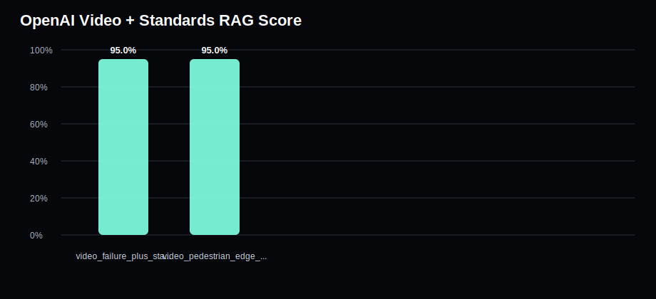
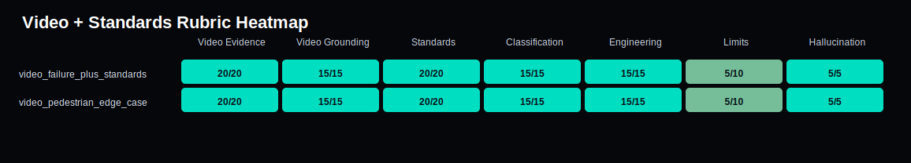

# OpenAI Video + Standards Evaluation

Generated: 2026-05-27T22:16:55

This evaluates the paid-tier capability: combining video transcript evidence with ISO standards reasoning.

## Video Standard Score

## Video Standard Heatmap

| Case | Score | Video Evidence | Standards | Classification | Engineering | Hallucination |
|---|---:|---:|---:|---:|---:|---:|
| video_failure_plus_standards | 95.0% | 20/20 | 20/20 | 15/15 | 15/15 | 5/5 |
| video_pedestrian_edge_case | 95.0% | 20/20 | 20/20 | 15/15 | 15/15 | 5/5 |

## video_failure_plus_standards

- Score: 95.0%
- Missing items: ['assumptions']
- Hallucination flags: None
- Answer: `evaluation/results/video_standard_answers_20260527_221613/video_failure_plus_standards__openai_video_standard.md`

## video_pedestrian_edge_case

- Score: 95.0%
- Missing items: ['assumptions']
- Hallucination flags: None
- Answer: `evaluation/results/video_standard_answers_20260527_221613/video_pedestrian_edge_case__openai_video_standard.md`
